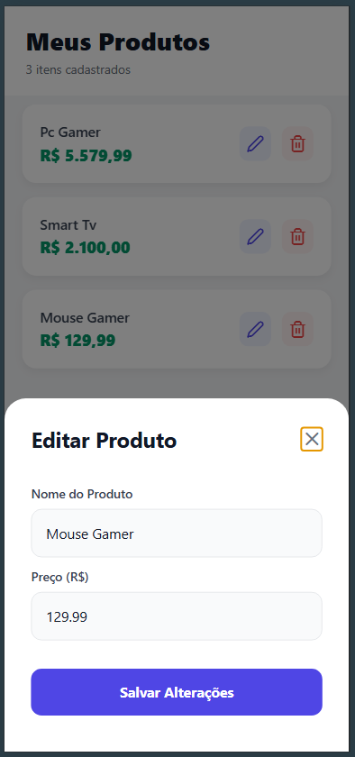

# Loja Virtual (Mobile App)


> Um aplicativo mobile multiplataforma (Android, iOS e Web) para gerenciamento de produtos, consumindo uma API REST própria.

🔗 **Repositório do Backend:** [Acesse Aqui](https://github.com/jmtmds/Desafio-Backend.git)

---

## 📸 Screenshots

| Tela Inicial (Home) | Edição de Produtos |
|:-------------------:|:-----------------:|
|  |  |

---

## 📜 Sobre o Projeto

Este aplicativo é a interface de usuário (Frontend) do desafio Full Stack. Ele foi desenvolvido utilizando **React Native** com **Expo**, focando em produtividade e código limpo.

O app se conecta ao backend para permitir que o usuário gerencie sua loja virtual de forma intuitiva, com feedback visual imediato e tratamento de erros de conexão.

---

## ✨ Funcionalidades

* **Listagem Dinâmica:** Exibe os produtos buscados da API em tempo real.
* **Design System:** Interface moderna, limpa e com feedback visual (ícones Feather, modais, sombras).
* **Gestão Completa:**
    * Adicionar novos produtos via Modal.
    * Editar produtos existentes.
    * Excluir itens da lista.
* **Formatação:** Exibição inteligente de valores monetários (R$).
* **Multiplataforma:** Funciona no navegador (Web) e dispositivos móveis (Android/iOS).

---

## 🚀 Tecnologias Utilizadas

* **React Native** (Framework Principal)
* **Expo** (Plataforma de desenvolvimento)
* **TypeScript** (Tipagem estática e segurança)
* **Axios** (Cliente HTTP para consumo da API)
* **Vector Icons** (Ícones profissionais).

---

## ⚙️ Como Executar Localmente

Para rodar este projeto, você precisa ter o **Backend** rodando simultaneamente.

**Pré-requisitos:**
* [Node.js](https://nodejs.org/) instalado.
* Backend rodando na porta 3000 (consulte o link do repositório acima).

**Passos:**

1. **Clone o repositório:**
   ```bash
   git clone https://github.com/jmtmds/Desafio-Frontend.git
   ```

2. **Instale as dependências:**
   ```bash
   npm install
   ```

3. **Inicie o projeto:**
   ```bash
   npx expo start
   ```

4. **Abra o aplicativo:**
   * Pressione `w` no terminal para abrir no navegador (Recomendado para testes rápidos).
   * Ou escaneie o QR Code com o app **Expo Go** no seu celular (Android/iOS).

> **Nota:** Se for rodar no celular físico, certifique-se de que o arquivo `App.tsx` ou seu `.env` aponta para o endereço IP da sua máquina na rede local, e não `localhost`.

---

## 👨‍💻 Autor

**João Marcos Tavares**

* **LinkedIn:** [linkedin.com/in/jmtmds](https://www.linkedin.com/in/jmtmds)
* **Email:** [jm3tavares@gmail.com](mailto:jm3tavares@gmail.com)
* **GitHub:** [github.com/jmtmds](https://github.com/jmtmds)
